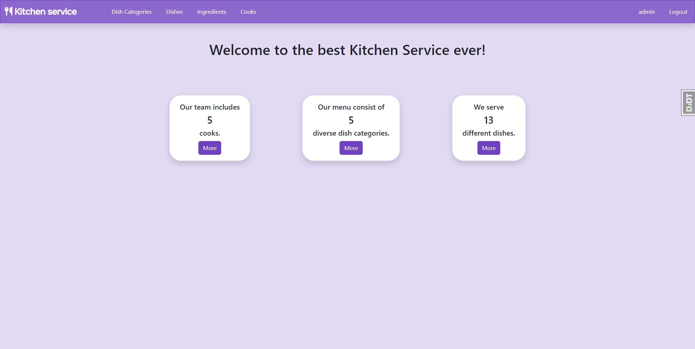

# Restaurant Kitchen Manage Service
<h3>Service for management menu and cooks.</h3>

## Check it out!

[Restaurant Kitchen Manage Service on Render](https://kitchen-manage-service.onrender.com)



## Data for authentication
```
Login: test_user
Password: JVV52zGB
```

## Features

- **Customizing menu:** Cook can create, update, delete new menu items
- **Big list** of different dishes, dish categories and ingredients
- **Editing cooks profiles**
- **Each cook** has his own list of created dishes
- **Each creator** can only edit menu items that he created himself.

## Installation

**For windows:**
```shell
git clone https://github.com/KristianYe/restaurant-kitchen.git
cd restaurant
python -m venv venv
venv\Scripts\activate
pip install -r requirements.txt
python manage.py makemigrations
python manage.py migrate
python manage.py loaddata test_data.json
python manage.py runserver
```

**For Mac:**
```shell
git clone https://github.com/KristianYe/restaurant-kitchen.git
cd restaurant
python3 -m venv venv
source venv/bin/activate
pip install -r requirements.txt
python manage.py makemigrations
python manage.py migrate
python manage.py loaddata test_data.json
python manage.py runserver
```